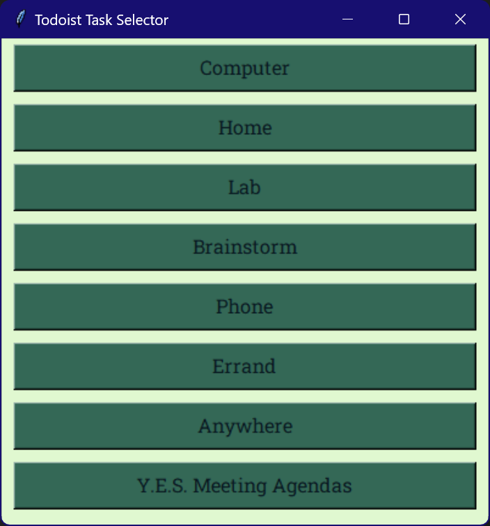
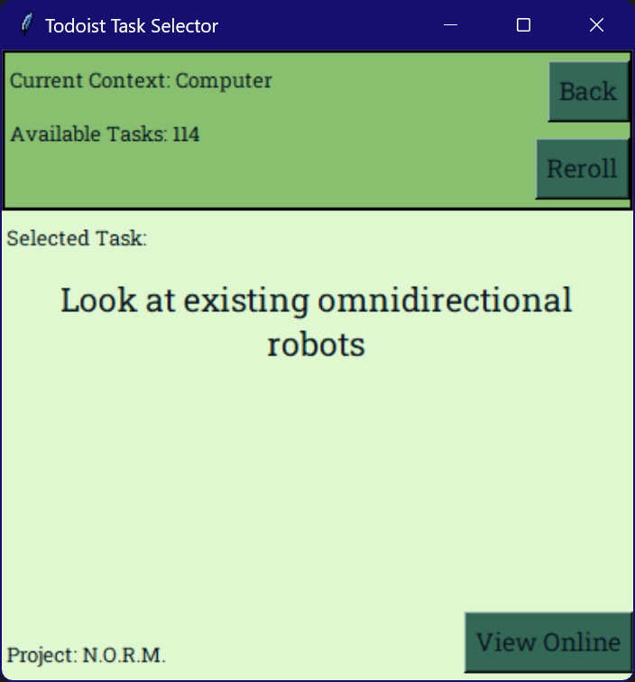

# Todoist Task Selector

This is a simple Python program that uses the Todoist API to randomly select a
task, based on the current context(or label).

Based on the way I use Todoist, labels represent contexts. For example, any task
with the `@Home` label is a task that can be done at home. This program asks the
user for their current context, and then randomly selects a task from the list.

This is designed to be as simple as possible, similar to just pulling a task out
of a hat. It's not meant to be a full-featured task manager.

When the program is run, a list will be shown of all the labels in the user's
Todoist account. The user can then select a label, and then a random task with
that label will be shown.

## GUI

The GUI is supposed to be simple and easy to use. It uses the colour palette of
the [BGB gameboy emulator](https://bgb.bircd.org/).

The context menu is shown below:

And the screen that shows the selected task is shown below:

## Requirements

This script requires the `todoist-python` package version 2.1.3.

## Setup

To use this script, you need to create a Todoist API token. This can be done by
following the instructions
[here](https://todoist.com/help/articles/find-your-api-token-Jpzx9IIlB).

after you have the token, create a file called `api_key.txt` and place it in a
folder called secrets. The file should contain only the token.
